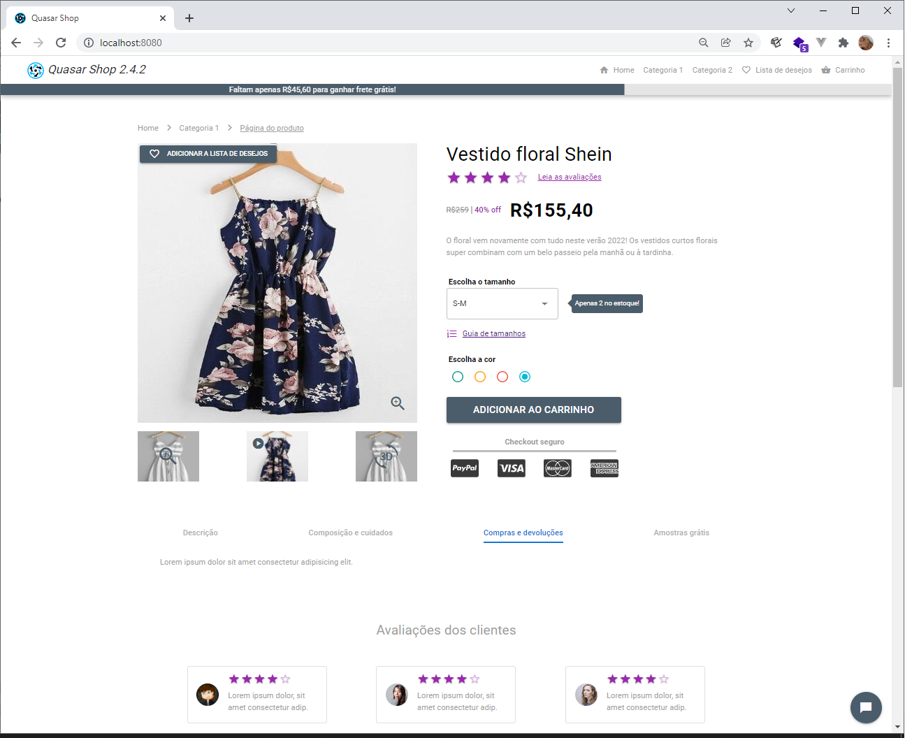
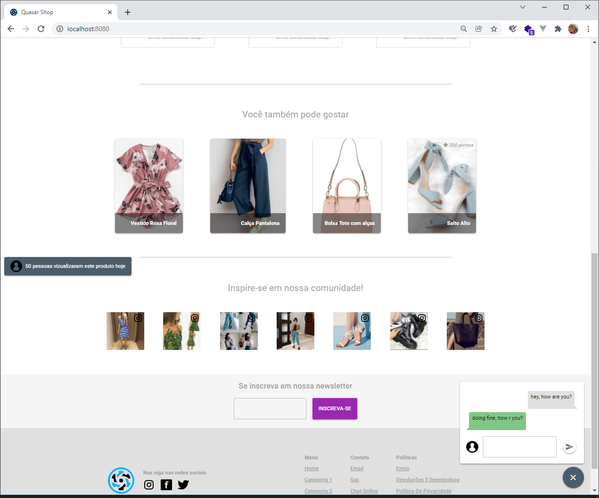

# Quasar Shop

> Teste no framework Quasar com o layout de uma página de produto

### **Página de produto com:**

- Header com logo, links para outras áreas do site (com animação no scroll)
- Barra de progresso no header com o valor restante para o cliente obter algum benefício (no caso frete grátis)
- Foto principal do produto em destaque com opção de zoom e de adicionar aos favoritos
- Seção com slide de fotografias, vídeos e visão 3d do produto
- Seção com título, nota do produto, valores, escolha de tamanho (com informação reativa sobre o estoque do produto), cores e botão CTA
- Seção com informações úteis sobre o produto (descrição, composição, etc.) com transição na troca da aba
- Seção de avaliações com cards contendo nota, avatar e feedback de cada cliente
- Seção com sugestões de produtos relacionados
- Seção "Inspire-se em nossa comunidade!" com fotos em redes sociais de clientes usando produtos vendidos pela página
- Opção de se inscrever em newsletter para captura de leads
- Footer com links, logo e chamada para redes sociais
- Página reativa
- Botão flutuante no canto direito inferior (pode ser alterado de posição pelo usuário) para contato via chat ao vivo
- Notificação ao carregar a página com número de usuários que visualizaram o produto

\*_Projeto ainda sem responsividade._

## Resultado

<code></code>
<code></code>

## Conclusões sobre o projeto

O Quasar é uma ferramenta incrível de desenvolvimento híbrido e tem uma curva de aprendizado muito pequena, projeto bem rápido, apesar de ser meu primeiro contato com a ferramenta foi muito fluido o desenvolvimento e sem dificuldades maiores.

Pontos que eu destaco sobre o Quasar Framework:

1. Ótima documentação
2. Curva de aprendizado muito pequena
3. Performance excelente
4. Estilização com classes parecido com o Bootstrap
5. Coleção extensa de componentes e plugins que suprem praticamente todas as necessidades do front-end
6. Um código e consigo criar aplicações web, mobile, desktop e até extensão pra navegador, é sensacional
7. É Vue 💚

Em breve trago mais projetos com o Quasar aqui pro meu GitHub.


# Instalação

## Install the dependencies

```bash
npm install
```

### Start the app in development mode (hot-code reloading, error reporting, etc.)

```bash
quasar dev
```

### Lint the files

```bash
npm run lint
```

### Build the app for production

```bash
quasar build
```

### Customize the configuration

See [Configuring quasar.conf.js](https://quasar.dev/quasar-cli/quasar-conf-js).
